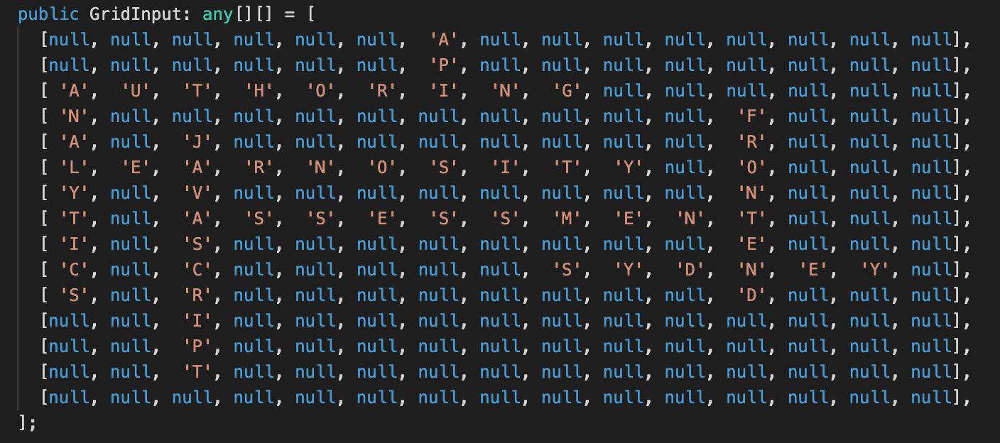

# crossword puzzle

The app is built using CRA and have bootstraped with Material UI for design system.

Based on the Input Array given, the gridHelper automatically fetches the Across And Down words to build up the Word Stack nd show it on screen.

On Validate, the wordstack chips will turn primary if the word is correct in the crossword else it will remain same.

On Show correct answer, the complete grid will be filled with the correct answer.

## Input Layout:
* 2D Array need sto be given for the crossword to work

Challenges Faced: In strict Typescripting :) Sometimes its a pain.